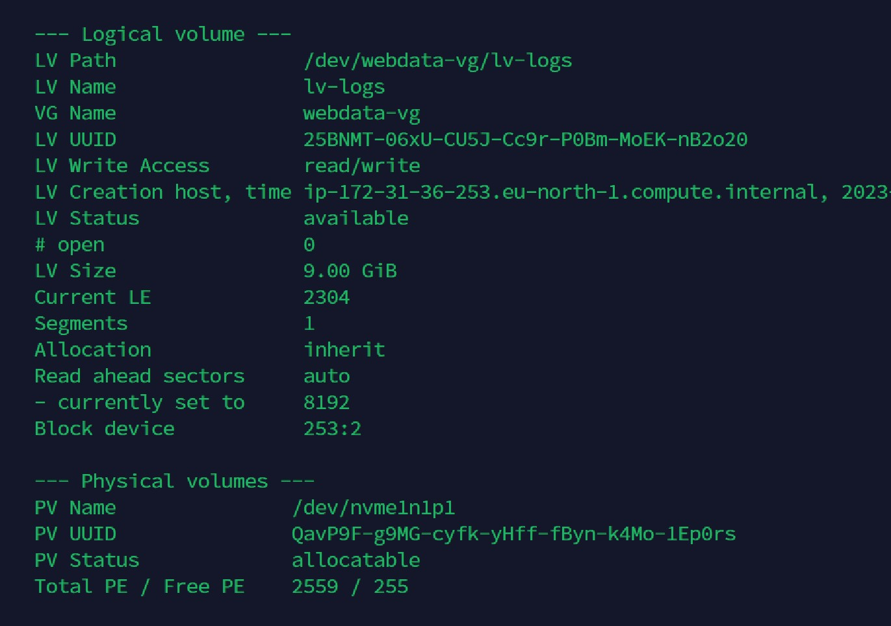

# Kingsley Documentation of Project 7

In this project, we will implement a tooling website solution which makes access to DevOps tools within the corporate infrastructure easily accessible.

## Step 1 - Prepare The NFS Server

1. Spin up a new EC2 instance with RHEL Linux 8 Operating System

2. Update Server

`sudo yum update -y`

3. Create 3 volumes in the same AZ as your Project7-nfs-server EC2, each of 10 GB

4. Attach all three volumes one by one to Project7-nfs-server  EC2 instance

5. Use `lsblk` command to inspect what block devices are attached to the server.

6.  Use gdisk utility to create a single partition on each of the 3 disks

`sudo gdisk /dev/nvme1n1`

`sudo gdisk /dev/nvme2n1`

`sudo gdisk /dev/nvme3n1`

7. Use `lsblk` utility to view the newly configured partition on each of the 3 disks.

8. Install lvm2 package using `sudo yum install lvm2` . Run `sudo lvmdiskscan` command to check for available partitions.

`sudo yum install lvm2 -y`

`sudo lvmdiskscan`

`lsblk`

9. Use `pvcreate` utility to mark each of 3 disks as physical volumes (PVs) to be used by LVM. That is create physical volumes from each of the partitions.

`sudo pvcreate /dev/nvme1n1p1 /dev/nvme2n1p1 /dev/nvme3n1p1`

`sudo lvmdiskscan`

10. Use `vgcreate` utility to add all 3 PVs to a volume group (VG). Name the VG webdata-vg

`sudo vgcreate webdata-vg /dev/nvme1n1p1 /dev/nvme2n1p1 /dev/nvme3n1p1`

`sudo vgs`

11. Use `lvcreate` utility to create 3 logical volumes.  lv-opt lv-apps, and lv-logs.

`sudo lvcreate -L 9G -n lv-opt webdata-vg`

`sudo lvcreate -L 9G -n lv-apps webdata-vg`

`sudo lvcreate -L 9G -n lv-logs webdata-vg`

12. Verify that your Logical Volume has been created successfully by running 

`sudo lvs`

`lsblk`

13. Verify the entire setup

`sudo vgdisplay -v`

14. Use mkfs to format the logical volumes with xfs filesystem

`sudo mkfs -t xfs /dev/webdata-vg/lv-apps`

`sudo mkfs -t xfs /dev/webdata-vg/lv-logs`

`sudo mkfs -t xfs /dev/webdata-vg/lv-opt`

15. Create mount points on /mnt directory for the logical volumes as follow:

`sudo mkdir /mnt/apps`

`sudo mkdir /mnt/logs`

`sudo mkdir /mnt/opt`

`ls /mnt/`

*Mount lv-apps on /mnt/apps – To be used by webservers*

*Mount lv-logs on /mnt/logs – To be used by webserver logs*

*Mount lv-opt on /mnt/opt – To be used by Jenkins server*

16. Mount logical volumes on the paths

`sudo mount /dev/webdata-vg/lv-apps /mnt/apps`

`sudo mount /dev/webdata-vg/lv-logs /mnt/logs`

`sudo mount /dev/webdata-vg/lv-opt /mnt/opt`

17. Install NFS server, configure it to start on reboot and make sure it is u and running

`sudo yum -y update`

`sudo yum install nfs-utils -y`

`sudo systemctl start nfs-server.service`

`sudo systemctl enable nfs-server.service`

`sudo systemctl status nfs-server.service`

18. Make sure you set up permission that will allow our Web servers to read, write and execute files on NFS.

`sudo chown -R nobody: /mnt/apps`

`sudo chown -R nobody: /mnt/logs`

`sudo chown -R nobody: /mnt/opt`

`sudo chmod -R 777 /mnt/apps`

`sudo chmod -R 777 /mnt/logs`

`sudo chmod -R 777 /mnt/opt`

`sudo systemctl restart nfs-server.service`

